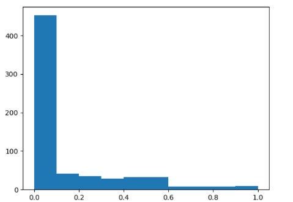

# Modeling European Coalition Governments

In this project, I analyzed election data from European countries spanning 1986-2011 to build predictive models for the proportion of cabinet seats parties would receive post-election negotiations. The data was from these two sources: 

Government formation as logrolling in high-dimensional issue spaces (Scott de Marchi with Michael Laver). 2020. Journal of Politics.

Government Formation in the Shadow of an Uncertain Future Election (Scott de Marchi with Michael Laver and Georg Vanberg). Forthcoming. In Edward Elgar Handbook of Coalition Politics.

## Table of Contents
#### Data Wrangling and Manipulation
#### Imputation/Missingness
#### Feature Selection
#### Theory
#### Assumptions Violated
#### PCA
#### Decision Trees
#### Interpreting the trees
#### Linear Models and Lasso Regularization
#### Pivotality Metric Analysis
#### Out-of-Sample Results and Conclusion

## Data Wrangling and Manipulation

In big data problems, my first step is to visualize the distribution of the dependent variable. In this dataset, it’s immediately evident that our DV does not follow a Gaussian distribution. The histogram of cabinet_proportion, depicted below, is zero-inflated. The fat tail immediately raises some potential concerns and cautions about the models.

Seeing a zero-inflated Y, I was left with a few decisions. One option I considered would be to separate the data into two models: one for rows where the cabinet proportion equaled 0 and one for everything else. I chose not to do this because separating the two might inadvertently lead to overlooking the nuances and crucial insights that determine whether a party is represented in the cabinet; keeping the data together would provide a holistic view of the data. Subsequently, as I discovered later on, there are a couple of key variables that explain a party’s representation in the cabinet that I wouldn’t have discovered through isolating zeros from non-zeros. Thus instead, to keep the data together but still have successful predictions, I first opted for a decision tree approach which aimed to find the feature(s) that split right here:

Although fat-tailed distributions can be dangerous, I acknowledged the limitations my models may present and kept my dataframe together.

## Imputation/Missingness

After this, I inspected the data more deeply and ran code to identify which columns were missing data. The five that were data were sq_cabinet, sq_pm, left_rightx, left_righty, and coalition_total. Before deleting missing rows, I explored the possibility of if I could easily impute values for these columns. For coalition_total, I went for a straightforward approach and imputed the missing values with zero. Cross-verifying with the binary variable cabinet_party to see if they were in the coalition, I confirmed that each of the rows with missing data in coalition_total was not in the winning coalition. Thus, to represent this, I imputed with 0. However, I recognize the flaw in this imputation. Coalition_total is not a measure that is specific to an individual party but rather the government during that year as a whole. I will get back to this later.

Next, for the missingness in the sq_pm column and sq_cabinet column, I at first attempted to do research to find the results, but with limited time on this project, I was unable to find accurate data. I also did not think it would be feasible to impute missingness for the ideology columns.

To address the issue of missingness, I decided to simply delete the rows with missing data in the left_rightx and left_right y columns (these rows were also missing data in the sq_pm and sq_cabinet column so I did not have to run additional code afterward to address those rows). However, before deleting, I wanted to gather information on the mean and standard deviation of our dependent variable and the two columns we were deleting to ensure that the removal did not significantly alter the dataset’s distribution. I also examined country distribution before and after removal to see if rows with missingness were more common for certain countries, and whether deleting rows affected the overall country distribution of the data set. Here are the results:

|  | Before deleting | After deleting | Difference |
| --- | --- | --- | --- |
| Cabinet_proportion mean | 0.129 | 0.166 | -0.037 |
| Cabinet_proportion standard deviation | 0.227 | 0.244 | -0.017 |
| Left_rightx mean | 5.056 | 5.407 | -0.351 |
| Left_rightx standard deviation | 2.306 | 2.082 | 0.224 |
| Left_righty mean | 5.331 | 5.331 | 0 |
| Left_righty standard deviation | 2.226 | 2.226 | 0 |

Evidently removing the missing rows did not have a significant effect on the distribution of our DV: cabinet_proportion. What was interesting however was how it significantly changed the country distribution. Before deleting, here was the country data:

There are a few takeaways that I observed from this data. First, excluding the missing rows removed entire countries from the dataset, these being Norway, Iceland, Luxembourg, and Portugal. And, the remaining composition of the countries also shifted. The number of rows from Italy dropped by almost 81% and the number of rows from Ireland dropped by almost 57%. Thus, by dropping left_rightx and left_right y it must be acknowledged that we are no longer modeling the same general data. While the original data set was biased toward modeling countries like Italy, Belgium, and the Netherlands, the new dataframe post-dropping skewed the representation of countries in a different way. Because of this, I was hesitant about dropping missing rows, particularly given the removal of four entire countries from the data, and briefly considered dropping the columns instead. However, I ultimately chose to drop the rows rather than columns to avoid the potential loss of valuable features that I believed could potentially contribute to the overall analysis of cabinet proportions. Nevertheless, it is imperative that I be mindful of the skewed distribution of countries when analyzing and interpreting my results and acknowledge this as a drawback of the models.

## Feature Selection

With the rows finalized, I began feature selection. I began by dropping all variables relating to the cabinet. This included cabinet_seats, total_cabinet_size, cabinet_party, cab_count, and largest_cab. This is because these rows lead to data leakage. Our data cannot contain direct information about our dependent variable because that information won’t be available when the model is actually used for prediction. For instance, if we’re trying to predict cabinet_proportion based on election results in the future, we won’t yet know how many total parties are in the cabinet (cab_count). Including these variables would lead to an extremely high performance on our available data but would do poorly in future predictions.

Next, I deleted duplicate columns that, despite having different names, conveyed identical information as some of the other columns. These included base, country and country_id (dummy variables tell us the same thing), and party name.

Further refining the data set, I dropped variables that weren’t specific to an individual party. My intention was that this would help the model train on features directly relevant to behaviors and characteristics of individual parties, disregarding general attributes that may not contribute meaningfully to the prediction of the DV. Thus, I choose to drop the coalition_total variable and my concern about imputation from above is obsolete. I dropped coalition_total because the number is the same for every party in the election, irrespective of electoral success and whether they won seats in the cabinet or not, and would thus not provide any meaningful insight into cabinet formation.

Finally, I dropped the following variables because I didn’t believe they were of any significance to cabinet_proportion: party, party_id, election_id, start_date, election_date, cabinet_id, cabinet_name, and party_name_english. For instance, the id variables are just identifier variables without any predictive power. Similarly, other variables like election date, party, and start date are likely just included in the dataframe for contextual information and don’t influence the variability in cabinet proportion.

Through feature selection, I aimed to streamline the dataset to avoid overfitting and allow for the models to only focus on essential and meaningful predictors.

## Theory

Now that my dataset was finalized, I did some research into coalition governments, to gain intuition and theory about the variables.

From this research, beyond gaining a deeper understanding of coalition governments, I learned a few key things. It seems that two key variables historically determine cabinet distribution, but the question arises of which one is more influential. Is it determined by how many seats a party wins in the general election or their pivotality? In simpler terms, in an election result of  [10 seats, 10, seats, and 1 seat] the question is whether almost 50% of cabinet seats go to party 1, almost 50% to party 2, and 0% to party 3, or are cabinet seats divided equally between the three parties because, in this scenario, the pivotality of each party is the same. Thus, I kept these two hypotheses in mind when constructing my models.

## Assumptions Violated

After reading up on the theory behind coalition governments and cabinet formation, I believe two key assumptions in machine learning are violated.

The assumption of independence and an identical distribution is violated. We’ve already seen this in our non-Gaussian distribution of Y. Moreover, independence is violated because strategy could be involved. For instance, party behavior might change from one year to the next. Parties might adopt more centrist values to secure more seats after a poor election or might change negotiation strategy and behavior if previously excluded from coalitions. Additionally, as mentioned before, the distribution of countries is not equal. Variations in the number of parties and frequency of elections among countries add another layer of non-IID data. Finally, the data is not independent because of the nature of coalition governments, where the actions and outcomes of one party are influenced by the behavior of every other party in the government.

The second assumption violated is that the data all come from the same data-generating process (DGP). The primary way this is evident is that our data spans 25 years. Parties, governments, and dynamics are never consistent across 25 years of governance. The political landscape can change, the behavior and ideology of parties can shift, and historical and current events can change the makeup of the electorate. Compounded by the inclusion of data from 13 different countries, the idea that our data comes from a consistent generating process is flawed.

It’s important to identify these issues with our data because the violations impact the validity of our models and these flaws must be recognized and considered when interpreting and analyzing results.

## PCA

I first standardized my numerical independent variables, excluding binary variables since standardizing them might compromise their interpretability. And, these binary variables captured qualitative attributes of the data, so standardizing wouldn’t make sense; there is no mean and standard deviation for qualitative attributes. I also opted not to standardize my dependent variable to facilitate an easier interpretation of error results. I then attempted to use a VIF table to identify multicollinearity but I was not able to extract any useful information. Thus, using theory and intuition about the variables, I constructed three latent variables.

The first was a latent_pivotality variable. From doing my own research, I determined that 'miw_new', 'Banzhaf', 'Shapley', 'splus', and 'miw_proportion' all represented the pivotality of a party in their own scoring metric. I entered all of these into a PCA and here were the results:

| Explained Variance | PC1: 0.795 | PC2: 0.193 | PC3: 0.0103 | PC4: 0.0010127 | PC5: 0.000357 |
| --- | --- | --- | --- | --- | --- |
| miw_new | 0.215 | 0.978 | ~0 | ~0 | ~0 |
| Banzhaf | 0.993 | -0.057 | 0.102 | ~0 | ~0 |
| Shapley | 0.999 | -0.045 | 0.030 | ~0 | ~0 |
| splus | 0.997 | -0.045 | 0.057 | ~0 | ~0 |
| miw_proportion | 0.980 | -0.065 | -0.192 | ~0 | ~0 |

From these results I concluded that a latent_pivotality variable that condensed Banzhaf, Shapley, splus, and miw_proportion into a single dimension would be beneficial as it captured a substantial portion of the variance across those four features. I removed those four columns from the dataframe and added the latent_pivotality variable.

Next, I ran a PCA with the variables related to how many seats a party had. These variables were 'seats', 'seats_share', 'seats_total', and 'seats_proportion.' The results from the PCA showed that while seats_total was not well explained by a reduction to a single dimension, a single dimension for seats, seats_share, and seats_proportion explained more than 87% of the variance across those three variables and each had an eigenvalue of over 0.91. Thus, to further simplify the data set I added latent_seats to the data and removed the three seats variables that went into it.

Finally, I combined left_rightx and left_right y into a single latent space. A single dimension for these two explained almost 99% of the variance, which makes intuitive sense. Thus, my final latent variable was latent_ideology.

## Decision Trees

As mentioned before, our DV is zero-inflated which means linear regressions aren’t optimal. So, I began my modeling with decision trees. I first split my data into train and test sets, opting for a 60-40 split.

I ran an initial model with the only parameter of max_depth being set to 5 to get an initial visualization of the important splits and to set a ceiling for my R-squared and MSE. This initial model had a training R-squared of 0.88 and a training MSE of 0.007 across 32 terminal nodes.

Following this, I explored various decision tree configurations. The first was one with an alpha tuning parameter, that I found using 5-fold cross-validation. From this, the best alpha value was 0.002154 with an average MSE on the left-out fold of 0.021. I was curious how the alpha value would change by increasing the number of folds, but overall the results were negligible. Using 10 folds gave an average MSE for the left-out bucket of 0.02124. Thus I stuck with 5 fold cv because the additional complexity of 10 folds did not yield any meaningful improvements.

Here is the resulting tree with just a cost-complexity tuning parameter:

The resulting tree had an R-squared of 0.748 and an MSE of 0.016. I will interpret this tree after explaining all the trees that I ran.

I next experimented with hyperparameters like max_depth, min_samples_split, min_samples_leaf, and max_leaf_nodes to see which combination would yield the best in-sample results. I used a grid search method to search the matrix of all possible combinations of those four hyperparameters, and the results that had the lowest MSE were max_leaf_nodes = 8, min_samples_leaf = 5, max_depth = none, and min_samples_split = 2. This returned a slightly larger tree than the cost complexity pruning one and had an R-squared of 0.807 and an MSE of 0.012. The tree is seen here:

I considered running an ensemble tree as well, such as a random forest or boosting model, but in this specific data problem, I did not want to sacrifice the interpretability of my trees. The primary goal of this assignment was to extract meaningful insights into coalition politics, and if it were a more professional project, provide insights into party leaders on what has historically determined the makeup of a cabinet. The inherent complex nature of ensemble approaches obscure any meaningful takeaways from the results, and I thus forwent that option.

#### Interpreting the trees

The variables that were split on in the decision trees unveiled some intriguing insights. Going back to this image:

The primary determinant for this split, according to the tree, is the prime minister variable. Essentially, winning the prime minister position guarantees your party at least one position in the cabinet. I confirmed this by looking at the Excel spreadsheet of the data, and every row with a ‘1’ for prime minister had at least 1 cabinet seat. If your party does not win the prime minister role, the next best explanatory variable to predict cabinet_proportion is sq_cabinet, which signifies the party’s presence in the previous coalition. If a party was part of the prior coalition, its cabinet_proportion tends to be higher. If a party neither wins prime minister nor had any cabinet seats in the prior coalition, the decision trees overall predict cabinet_proportion to be 0.035, or essentially zero. This logical sequence makes sense because winning the prime minister signifies a party’s significant role and influence in the government, as well as its overall popularity among the electorate. Conversely, if a party lacks both the current leadership (prime minister) and historical experience (prior coalition representation), it is less likely to secure cabinet seats in the current coalition.

If the party did when prime minister, then its pivotality is most important. If a party has high pivotality, i.e. if it holds a crucial position in the formation and stability of a government and is important in passing the winning threshold, then that party will command more seats in the cabinet than those with lower pivotality. This is the essence of the simplest decision tree, but a more extensive tree introduces additional splits.

For instance, if a party did not win prime minister but did have representation in the last cabinet (66 parties across the data), then the next most important feature is latent_seats, a metric indicating the number of seats a party won in the election. This implies that if the party is more popular among the populous and has more electoral success, it will be granted more seats in the cabinet. This aligns with the hypothesis from earlier that parties with more seats, and a stronger electoral mandate wield more influence in bargaining and coalition negotiations for this specific circumstance.

On the other side of the tree, if a party wins prime minister, and has a high pivotality value, mingov becomes the next most important feature. This split captures the distinctive scenario of when a ruling party does not hold an absolute majority in the number of seats. The logic is that parties in minority governments may have to more delicately balance coalition negotiations, leading to a broader representation of parties in the cabinet.

While I don’t think it’s necessary to bog down in further specifics in the trees, larger trees allow for a more nuanced approach that can capture some of the less obvious patterns in the data and allow for insights beyond simple divisions. However, they may be prone to overfitting the training data, so analysis of the test results will confirm if these trees are robust.

The strengths of the decision tree for this data are clear. They allow for a transparent and interpretable representation that provides step-by-step logic on how parties are represented in cabinets. The trees clearly identified the important features and were able to handle a non-linear, zero-inflated dependent variable.

## Linear Models and Lasso Regularization

I wanted to see how linear models would perform as well and if the results were consistent with the results from the decision trees. Just like I did for decision trees, I established a performance ceiling and ran an ordinary least squares regression with every variable. The model yielded an R-squared of 0.77 and an MSE of 0.0149.

I then ran lasso regularization and was curious if it would identify the similar important features that the decision tree split on. These are the results from my clearest lasso regularization:

Overall, the results are pretty consistent. At a low alpha value, prime minister is the most important, and as we penalize the coefficients, latent_pivotality and latent_seats remain. The minor variables are also consistent as we see sq_cabinet, sq_pm, and mingov are more influential when we prioritize bias over variance. The best alpha value, 0.00189, was found using 5-fold cross-validation (again, results were pretty consistent when I increased folds so for the sake of simplicity I opted for 5 bins) and resulted in an average out-of-fold MSE of 0.0157. The equation at the best alpha value is this:

y = 0.0513 * sq_cabinet + -0.0840 * sq_pm + 0.0002 * election_year + -0.0261 * miw_new + 0.3125 * prime_minister + 0.0145 * party_count + 0.0061 * enpp + 0.0128 * mingov + 0.0007 * seats_total + 0.0004 * W + 0.0594 * latent_pivotality + 0.0089 * latent_seats

From this we can see that prime minister is by far more important in its predictive power than any of the other variables. But after that, sq_pm, sq_cabinet, and latent_pivotality are important, emphasizing that historical precedence and a party’s importance in forming a coalition are the next most important features. The results from the lasso regularization equation yielded an MSE of 0.0157 and an R-squared of 0.759. Interestingly, the results are almost identical to the regularized decision tree, so we will have to see which one performs better out-of-sample.

Using the best IVs that the lasso identified, I then wanted to try polynomial regressions ranging from degrees 1-3. Here are the results:

|  | MSE | R-squared |
| --- | --- | --- |
| Degree 1 | 0.0154 | 0.763 |
| Degree 2 | 0.013 | 0.798 |
| Degree 3 | 0.019 | 0.707 |

Overall, the improvement in MSE from degree 1 to degree 2 is minimal and even decreases when we move to degree 3. Thus, because performance is overall nearly the same, I’m inclined to prefer the degree 1 equation as it facilitates a better understanding of the relationship between the IVs and DV and is easier to interpret.

So, while the linear models provided similar results to the decision trees, and offered some insight into the important features, it’s difficult to discern the complexities and interactions at play from simple polynomial equations. We were able to conclude that historical variables were influential, but the depth of these relationships and the interplay between variables is too nuanced for linear models to capture.

## Pivotality Metric Analysis

I was able to deduce that the most important IVs were prime minister, pivotality, sq variables, and a few others. However, I was curious as to which pivotality metrics were best, so I ran a lasso regularization exclusively with the pivotality variables and cabinet_proportion and found that Banzhaf and splus were most influential. Lasso seen here:

I pondered running new regressions with just these two variables in latent_pivotality to see if it would do better out-of-sample by avoiding overfitting. However, I was hesitant and considered the possibility that other pivotality metrics might still hold significance. Rather, lasso regularization could have yielded these results because it was forced to choose a couple of important variables because of the nature of how the coefficients are calculated. Nonetheless, it appears as though the Banzhaf and splus pivotality metrics are the most influential.

## Out-of-Sample Results and Conclusion

Having run a sufficient number of models, I turned to testing them out-of-sample to see which one held up the best.

Here are the out-of-sample results from my best in-sample models:

|  | Test MSE | Test R-squared |
| --- | --- | --- |
| Unpruned DT | 0.027 | 0.455 |
| Regularized DT | 0.025 | 0.493 |
| Gridsearch DT | 0.024 | 0.524 |
| Ordinary Least Squares | 0.029 | 0.431 |
| Lasso regularization | 0.024 | 0.524 |
| Degree 1 polynomial | 0.026 | 0.478 |
| Degree 2 | 0.019 | 0.613 |
| Degree 3 | 0.022 | 0.559 |

Comparing the OOS errors to the training errors, there was a slight decrease in R-squared (an average of 0.2) and a slight decrease in MSE (an average of 0.01) but overall the models performed well. A worse performance on the test data is likely because of minor disparities between the train and test sets. For instance, if there was no data from Finland in the training data, the model would not generalize well to coalition negotiations in Finland and would have higher out-of-sample error results for those rows. Furthermore, while I attempted to avoid overfitting by adopting k-fold cross-validation, it’s not foolproof and thus my models could have learned from some randomness and noise in the data.

I then tested for robustness in these results by changing the random seed in my train test split. I tried a few new seeds and overall my results were consistent. The alphas deviated by around 0.005 depending on the seed for both lasso and decision tree regularization, R-squared changed by as much as 0.2, but MSE was overall very consistent; it deviated by at most 0.003 across the few seeds and models that I tested on. The robustness of these models implies the observed patterns are relatively stable and that my models are generally resistant to the randomness of train test splits. This observation enhances the reliability of my model’s findings and suggests that the results aren’t from specific random splits in the data but rather due to underlying patterns in cabinet formation.

Very surprisingly, out of all my models, a degree 2 polynomial performed slightly better than all the rest. A possible explanation for the success of a second-degree polynomial could be that the equation was able to identify and fit to the known nonlinear relationships in the data. Alternatively, I could have gotten unlucky in my train vs test set distributions, and the few random seeds I tried. The presence of heteroskedasticity in my errors, across all of the linear equations, means that the true relationship is nonlinear, and with a larger dataset, I would predict linear models to underperform compared to decision trees in predictive accuracy.

Despite this, for practical application, I would favor the simplicity of the degree 1 regression over degree 2. As mentioned above when comparing my training errors, and now when comparing test errors, the decrease in MSE for a degree 2 polynomial is not significant enough to justify sacrificing the interpretability of a single-degree linear equation. But even more, because of the errors in the linear regression models like heteroskedasticity among other shortcomings, I believe my best model overall to be my hyperparameter-tuned decision tree. This decision tree strikes a balance between a not overly complex structure yet niche tree that captures the most important features in determining cabinet_proportion, and performs well out-of-sample. I did not opt for the simplistic, regularized decision tree because it doesn’t seem to capture the underlying patterns in cabinet formation beyond just pivotality, prime minister, and cabinet precedence. This is evident in the slightly worse MSE that the regularized decision tree yielded compared to the hypertuned tree. While 0.02 may not be significant, this difference could be attributed to random fluctuations and patterns in the test set, or, it may indicate a suboptimal performance in capturing real-world complexities inherent in coalition formation.

Overall though, decision trees excel at handling nonlinear, zero-inflated DVs like is present in this scenario, and its interpretative power makes it a more practical choice for real-world applications. If either of these trees were deployed in future European elections, I would expect it to perform well.

In substantive terms, the MSE for the hypertuned tree suggests an anticipated difference of just under 0.15 percentage points between our predicted and actual cabinet_proportion for a given party within that coalition. While this may seem large, the context of this social sciences problem, involving political science and coalition dynamics that involve complex human behavior, negotiation strategy, and other factors, tempers expectations for extremely high test mean squared errors or R-squared values. For this reason, I’m inclined to trust the accuracy of some of these models which performed well out-of-sample. For further analysis of the significance of 0.15 in terms of cabinet_proportion, I looked deeper into the data. On average, the size of the cabinets across countries was 19 positions. This implies that, although the direction is unspecified, the model tends to deviate by around three seats from the true number of seats the party holds. While this may seem like a significant number of seats, I assess this model to be successful because the decision tree successfully captures overarching trends and important variables in cabinet distribution that are relatively consistent when applied to unseen data.

Nevertheless, as mentioned earlier, a few key modeling assumptions were violated and they must be considered when interpreting our results. Problems with the model include:

- Data is not IID. DV is not normal, strategy is inherent to coalition negotiations, and country distribution is unequal. On this note, while I didn’t test for this, deleting the missing rows could have altered the distribution of other features in addition to the country column. This could create problems because if the missingness of the data was not random, and skewed for example toward data pre-2000 elections, this could further exacerbate the potential for skewed results.
- Data does not come from the same DGP. Data spans 13 countries and over 20 years. Both factors determine the political landscape, decisions made by the electorate, and dynamics of coalition politics.

As a result, these findings must be carefully analyzed and applied with caution if used in future settings, and the country, political landscape, and year of the election must be considered and taken into account.

Nonetheless, a hypertuned decision tree or a regularized tree with a tuning parameter offers valuable insights into the intricacies of coalition politics, revealing the important factors that determine the cabinet distributions for coalition governments. While the models may not be ultra-successful in precisely predicting cabinet_proportion on unseen data, the success of these decision tree models lies in the simple and interpretable narrative they provide, thus rendering them effective models for this dataset.
